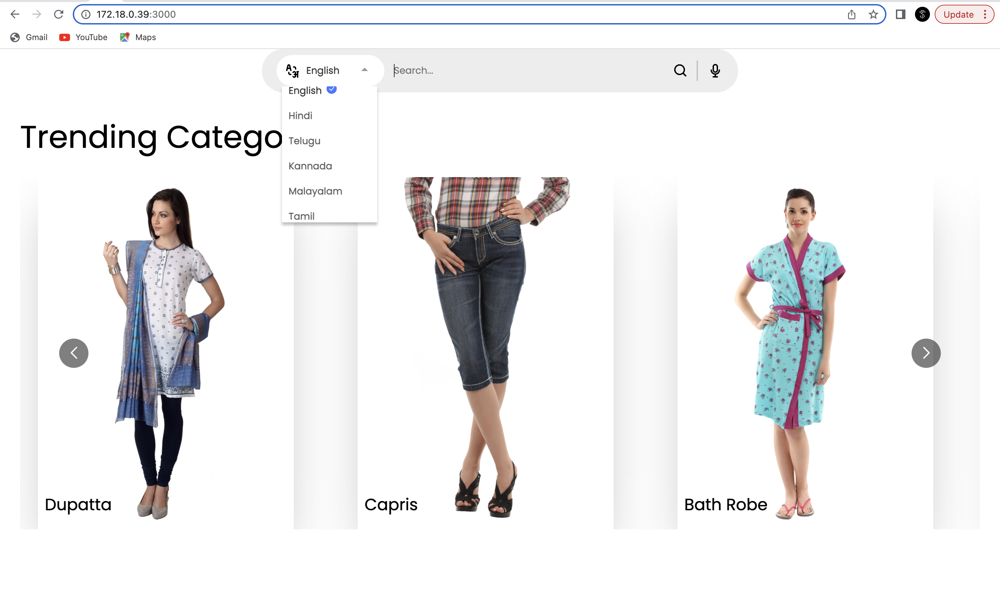

# KGQA
Knowledge Graph Question Answering is an e-commerce website where user can search their desired product like blue shirt, track pants, socks, belt etc. in their native language as well as in English and get their desired results.

Currently it supports 8 Indian languages i.e Hindi, Telugu, Kannada, Malayalam, Tamil, Bengali, Gujurati and Marathi.

It has both text and voice search feature for user convenience as shown below.

We have used a combination of 2 types of search here :

1. Knowledge Graph based search 
2. Embedding search (ML based)

When you search for a product, it first checks the language, if the query is in any language other than English, then it gets translated to English and then searches for it. 

It also handles mispelled words if present in the query text.

# docker build

sh run_docker.sh

# How to run :

docker-compose up

# Staging link

[Click here to view app](http://172.18.0.39:3000/)

